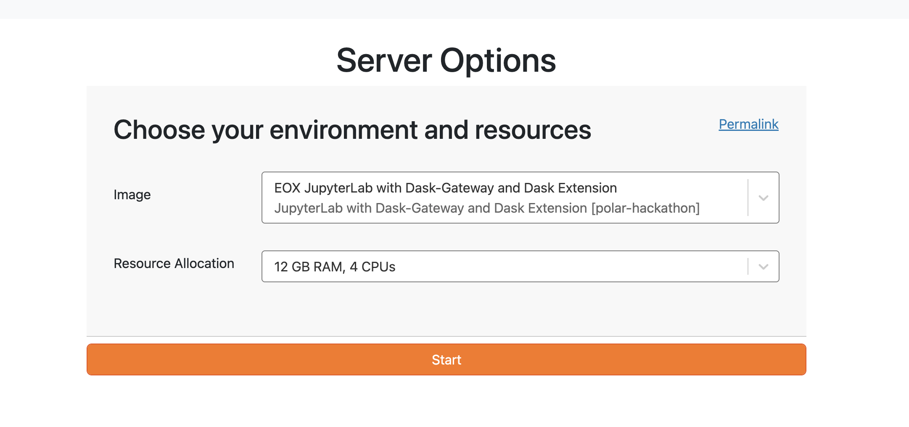
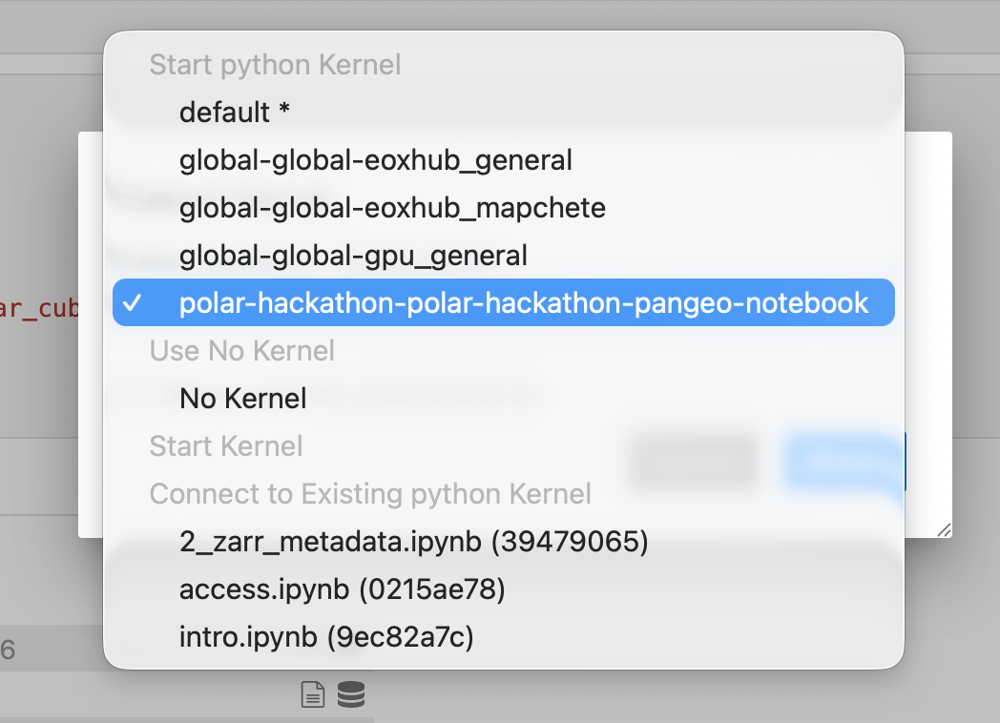

# Setup

## Working Locally

The notebooks assume a Python geospatial environment with common Pangeo tools: `xarray`, `dask`, `geopandas`, `rasterio`, `rioxarray`, `pyproj`, `shapely`, `pandas`, `numpy`, `matplotlib`, and `pystac` for metadata examples. You can install the pangeo-notebook environment from:

`conda create -n pangeo-notebook --file https://raw.githubusercontent.com/pangeo-data/pangeo-docker-images/refs/heads/master/pangeo-notebook/conda-linux-64.lock`

Network access is only needed for remote object-store reads or optional source downloads. The format tutorials are written so downloaded examples land in `downloaded_data/` and can be regenerated instead of committed.

## Working on Polar TEP and EarthCODE Workspaces

If you are using the provided cloud platform environment these notebooks and environment will already have all needed packages installed. Furthermore, there is a shared `/bucket/` directory  for collaboration.

**You can directly start working in the environment. You can access this cloud environment during the week of the online pre-hackathon and the week after!**

To request an account (only available during the workshop!) click on the following and use your github account to sign in: https://workspace.polar-hackathon.hub-otc-sc.eox.at

The login, you must have a [GitHub account](https://docs.github.com/en/get-started/start-your-journey/creating-an-account-on-github).

We will need to approve access for you to the online workspaces. You can then directly clone and open this workshop by just following the link below:
https://workspace.polar-hackathon.hub-otc-sc.eox.at/hub/user-redirect/git-pull?repo=https%3A%2F%2Fgithub.com%2FESA-EarthCODE%2Fpolar_hackathon&urlpath=lab%2Ftree%2Fpolar_hackathon%2F0_Introduction%2Fintro.ipynb&branch=main

Make sure to select the correct environment size - Dask Gateway and 12gb RAM 4 CPU as shown in the screenshot below

See [the introduction to Polar TEP](./Polar-TEP/polar-tep.md) for more details.

After you enter the environment, and open a notebook, you might be asked to select a kernel - select `polar-hackathon-polar-hackathon-pangeo-notebook`

