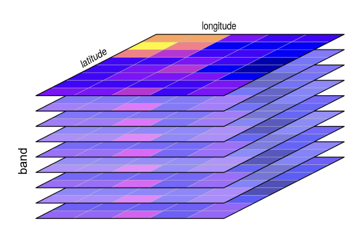
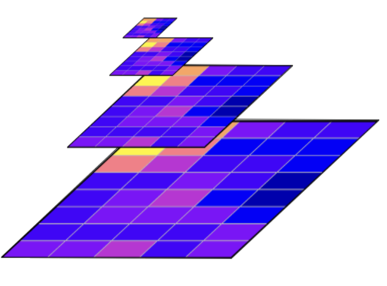
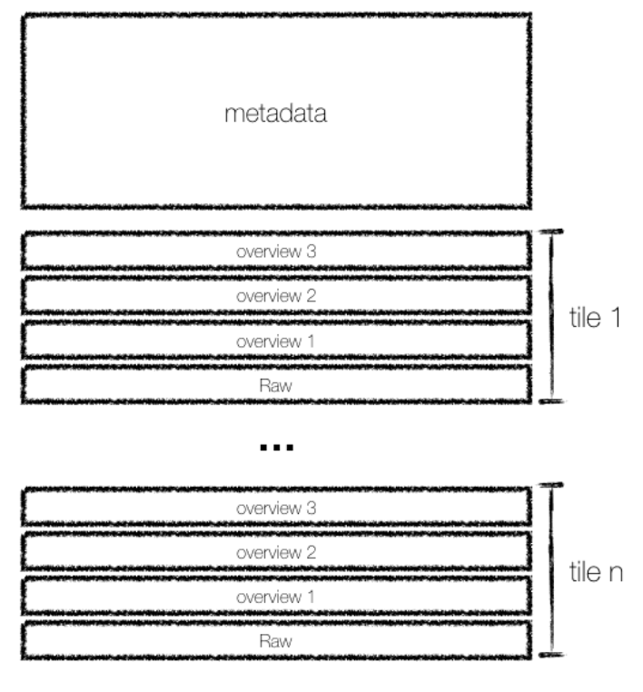
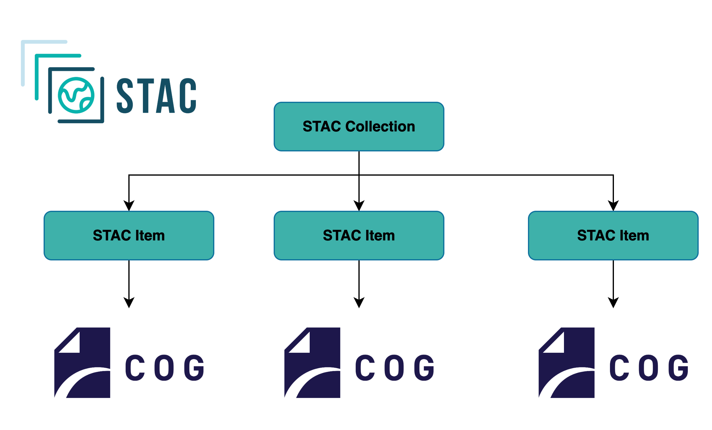

# COG

A GeoTIFF is a standard image file format (.tif or .tiff) that includes geospatial information, such as its coordinate system, projection, and location on the Earth. It is used for raster data representing a snapshot in time of gridded data. GeoTIFFs are typically used to represent a single snapshot in time of data like:
- A satellite image or aerial photograph.
- A Digital Elevation Model (DEM).
- A land cover or vegetation map.
- A single variable from a climate model output.

A Cloud-Optimized GeoTIFF (COG) is a regular GeoTIFF file, but it is organized internally in a way that enables highly efficient access in cloud environments. It is not a new format, but rather a profile for how a GeoTIFF should be structured. Because it is still a valid GeoTIFF, it remains fully compatible with traditional desktop GIS software like QGIS and ArcGIS.


The cloud optimization comes from two key features

1. Internal Tiling, where the pixel data in the file is organized into a grid of smaller, independent squares called tiles instead of simple rows. This tiling allows a program to read just a small area of the raster without having to process all the row data that precedes it;




 1. Overviews (Pyramids), a COG contains several pre-calculated, lower-resolution versions of the image stored within the same file. These overviews allow applications to quickly use resampled scenes at different resolutions levels without having to read the full-resolution data and downsample it on the fly.




The file's entire structure is described in a metadata header containing Image File Directories (IFDs), located at the very beginning of the file. This index-first layout enables an efficient workflow for clients like python libraries, web browsers or GIS applications:

1. Fetch the Index, the client sends a single, small HTTP request to fetch only the header. It parses this data to read the IFDs, which act as a complete "table of contents" for the file, mapping out the byte locations of all tiles for all overviews and the full-resolution image.
2. Request Only the Necessary Data, based on the user's current zoom level and location, the client calculates which specific tiles it needs from the appropriate layer (e.g., a low-resolution overview if zoomed out). Using the locations from the IFDs, it sends targeted HTTP GET range requests to download only those necessary tiles, completely ignoring the rest of the file.



While the COG format optimizes how you access a *single* raster file, most real-world datasets consist of many individual files. The **SpatioTemporal Asset Catalog (STAC)** specification solves the problem of how to discover and manage these large collections, adding valuable data such as date, time and variables modelled.



The typical workflow for a user or application combines the strengths of both STAC and COG:

-  **Search and Discover (with STAC):** First, you query a STAC API with your specific criteria (e.g., a geographic bounding box, a time range, and a product name). The API returns a list of STAC Items, which are lightweight JSON files containing rich metadata and, most importantly, a direct URL to the COG asset(s) see more in [STAC documentation](https://stacspec.org/en/tutorials/)

```py
# using pystac client
catalog.search(
    collections=["sentinel-2-l2a"], 
    bbox=[-6, 50, 2, 56],                      
    datetime="2024-06-01/2024-06-30",         
    query={"eo:cloud_cover":"<10"}               
).items()
items
```

-  **Efficiently Access (with COG):** Once your application has the direct URL from the STAC Item, it can use the efficient access patterns described above. It reads the COG's header and makes targeted HTTP range requests to download only the pixels for your specific area and resolution of interest.

```py
# using libraries such as ODC STAC and xarray
stac_load(
    stac_items,
    bands=("nir", "swir22"),
    chunks={},
    bbox=[-6, 50, 2, 56]
)
```

This two-stage data layout and process allows you to efficiently find the exact scenes you need from datasets and then efficiently download only the data you need from those scenes.

## Best Practice: One Variable Per COG

When creating your data, you have a choice: should a single COG file contain multiple variables (as bands), or should each variable be a separate COG?

While a single COG can contain multiple bands (e.g., red, green, and blue for a true-color image), the **recommended best practice for EarthCODE is to store each distinct variable as a separate COG file.**

This "one variable per file" approach offers greater flexibility for users. It allows them to find and access only the specific bands required for their analysis, reducing data transfer and complexity. In a STAC Item, these separate files are clearly listed as distinct assets (e.g., with keys like `"red"`, `"nir"`, or `"wind_speed"`), making the data more explicit and easier for automated tools to consume.

## Best Practice: Group Related Assets into a Single STAC Item

A single STAC Item should represent a single, discrete observation in space and time, such as a satellite scene or a specific model run. The guiding principle is: **all data files (COGs) that are captured or produced together as part of that single observation should be grouped as assets within one STAC Item.**

For instance, if a satellite captures an image with 12 different spectral bands at a specific time and location, this should be represented as **one STAC Item**. That single Item would then contain a list of 12 assets, with each asset linking to the separate COG file for each band (e.g., "red", "nir", "swir16", etc.).

This approach has several key benefits:

* **Reduces Redundancy:** Common metadata like the geometry, timestamp, projection, and cloud cover are defined only once in the Item's properties, rather than being repeated for each band.
* **Improves Discoverability:** When users search a catalog, their results are not cluttered with multiple entries for the same scene. They can find a single Item and see all the available data for it at a glance.
* **Logical Cohesion:** It provides users with a complete, logical package of data for a given observation, which is how most scientific analysis is performed.

## Best Practice: Zarr for Data Cubes, COG+STAC for Scene Collections

When dealing with many COGs/GeoTIFFs you will have a choice of either consolidating them (in a zarr store or a virtual zarr store) or using STAC to describe them as assets.

**Use Zarr if your data forms a dense data cube.** If your many files represent slices of a regular, multi-dimensional grid (e.g., a time series over a fixed spatial area), consolidate them into a single Zarr store. This is far more efficient for analysis, as users can access the entire dataset as one logical array. The entire Zarr store should then be described by a single STAC Item.

**Use Kerchunk to create virtual data cubes from existing COGs.** Kerchunk when you have a large collection of existing GeoTIFFs/COGs that you want to treat as a data cube *without reformatting*. For instance, if you have a time series stored as one COG per day, Kerchunk can scan the entire collection and create a single index file. This index presents the stack of 2D files as a virtual 3D Zarr array with a `time` dimension. This enables users to perform efficient data cube analysis (e.g., time-series extraction) directly on the original files, avoiding the costly step of rewriting them. This virtual dataset is then described by a single STAC Item.

**Use COG + STAC if your data is a collection of discrete scenes.** If your files are individual observations with varying footprints or irregular timestamps (like many satellite archives), keep them as separate COG files. Each distinct scene should be described by its own STAC Item, which in turn points to the relevant COG assets.

If your data consists of hundreds of thousands of individual GeoTIFFs that cannot be consolidated into a Zarr store or would otherwise be unwieldy as an individual STAC item per COG, the best practice is to group them logically using a **"one Item per scene"** strategy. Each discrete observation, such as a single satellite scene and all its spectral bands, should be represented by a single STAC Item.

## When to Use COGs+STAC in EarthCODE
Choosing between a collection of COGs and a consolidated data cube format like Zarr can be challenging, especially when your dataset spans a long time period.

As a general guideline, we recommend the **COG+STAC** approach when the primary focus of your data product is on **individual scenes** and workflows that use a **small number of variables**. This pattern is better when the "scene" is the main unit of interest, such as:
* **Event-based analysis:** Inspecting a discrete event like a flood, wildfire, or landslide by looking at the image captured on a specific day.
* **"Before and after" comparisons:** Analyzing change by comparing two or three distinct scenes from different points in time.

Conversely, if the main analytical goal is performing calculations across a long time series for every pixel, or running complex multi-dimensional queries, consolidating your data into a **Zarr** data cube is the recommended approach for EarthCODE data.
