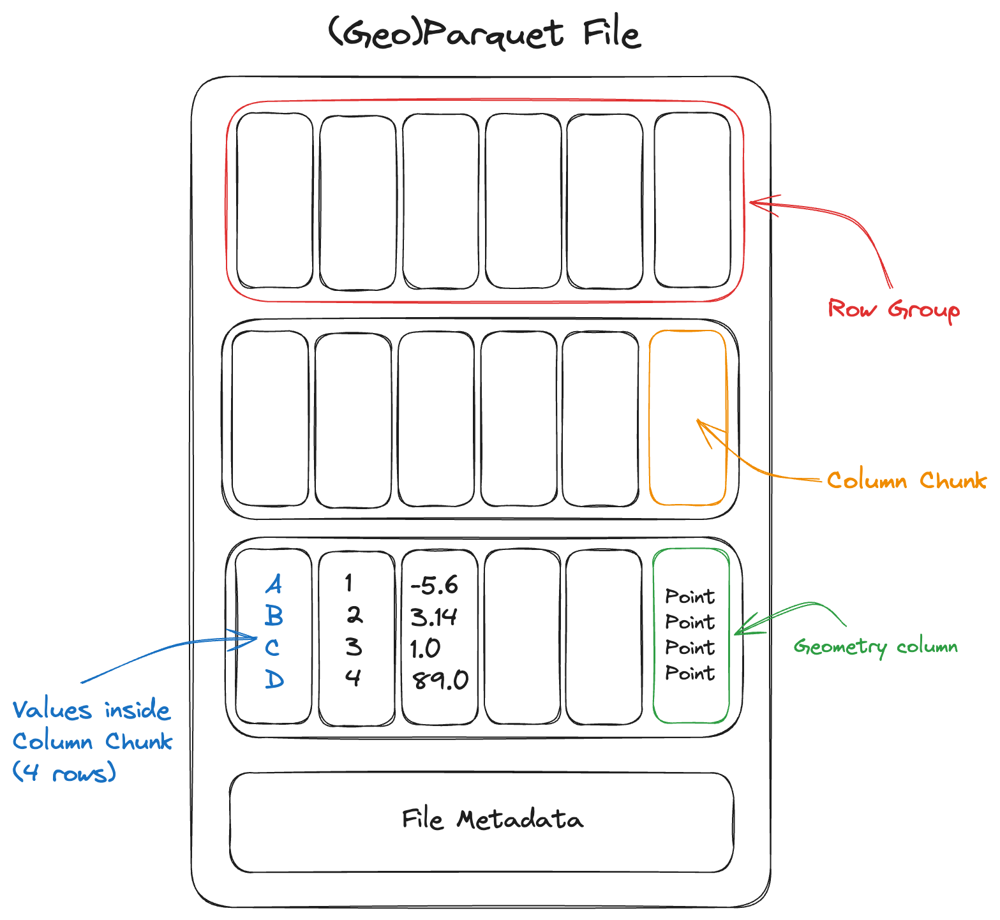

# GeoParquet

GeoParquet is a cloud-friendly way to store geospatial vector data, such as points, lines, and polygons, in [Apache Parquet](https://parquet.apache.org/). It is useful when the data is fundamentally a table of features with geometry and attributes, rather than a raster image or a gridded data cube.

Parquet is a columnar storage format with broad support across data tools. GeoParquet builds on it by defining how geometry columns and geospatial metadata, such as the coordinate reference system (CRS), are stored. Because GeoParquet is still standard Parquet, general-purpose tools can read the table, while geospatial tools such as GeoPandas, GDAL, and QGIS can also interpret the geometry.

This page is adapted from the [Cloud-Native Geospatial Guide](https://guide.cloudnativegeo.org/geoparquet/), with examples from polar data access workflows.

## Where GeoParquet Fits

Use GeoParquet for vector or tabular geospatial datasets:

- grounding lines;
- calving fronts;
- glacier outlines;
- drainage basins;
- point observations;
- ship, buoy, or field campaign tracks;
- feature tables with geometry and attributes.

For scene-like raster imagery, use COG. For dense, aligned multidimensional arrays, use Zarr. GeoParquet fills the vector-data role in the same cloud-native ecosystem.

GeoParquet is especially useful for object storage because readers can fetch selected columns and row groups rather than treating the file as one large download. That makes it practical to work with large feature tables from Python, GIS tools, or query engines.

## Example: Antarctic Grounding Lines

Antarctic grounding lines are a natural vector dataset: each feature has a line geometry plus attributes such as date and sensor. The example below reads a GeoParquet file directly from object storage using GeoPandas.

```python
import geopandas as gpd

bucket = "s3://EarthCODE/"
endpoint_url = "https://s3.waw4-1.cloudferro.com"
region_name = "eu-west-2"
file = "OSCAssets/polar_cube_datasets/groundlines/InSAR_GL_Antarctica.parquet"

gdf = gpd.read_parquet(
    f"{bucket}{file}",
    storage_options={
        "anon": True,
        "client_kwargs": {
            "endpoint_url": endpoint_url,
            "region_name": region_name,
        },
    },
)

gdf.head()
```

Once loaded, the data behaves like a normal GeoDataFrame:

```python
gdf["SENSOR"].unique()
```

You can reproject and plot the geometries in Antarctic Polar Stereographic coordinates:

```python
import matplotlib.pyplot as plt

fig, ax = plt.subplots(figsize=(12, 12))
gdf.to_crs("EPSG:3031").plot(column="SENSOR", legend=True, ax=ax)
ax.set_title("Grounding-line observations by sensor")
```

The important pattern is simple: open the remote vector asset directly, inspect its attributes, and then filter, plot, or join it with other datasets.

## Reading and Writing

Reading and writing GeoParquet has been [supported in GDAL since version 3.5](https://gdal.org/drivers/vector/parquet.html), so it can be used in software such as GeoPandas and QGIS.

> **Warning**
>
> In GeoPandas, use [`read_parquet`](https://geopandas.org/en/stable/docs/reference/api/geopandas.read_parquet.html) and [`to_parquet`](https://geopandas.org/en/stable/docs/reference/api/geopandas.GeoDataFrame.to_parquet.html) to read and write GeoParquet. These are different from `read_file` and `to_file`, which are commonly used for formats such as Shapefile or GeoPackage.

Because GeoParquet stores geometries in standard [Well-Known Binary](https://en.wikipedia.org/wiki/Well-known_text_representation_of_geometry#Well-known_binary) (WKB), it supports the geometry types defined in the OGC Simple Features specification: `Point`, `LineString`, `Polygon`, `MultiPoint`, `MultiLineString`, `MultiPolygon`, and `GeometryCollection`.

Where possible, store a single geometry type per file. For example, a grounding-line dataset is easier to consume if all features are line geometries.

## File Layout

Parquet files are laid out differently from row-oriented formats like CSV or FlatGeobuf.



A Parquet file consists of a sequence of chunks called row groups. Each row group contains column chunks: contiguous blocks of values for each column. All row groups in the file share the same schema.

The file footer stores metadata describing the schema, the byte range of every column chunk, and optional column statistics such as minimum and maximum values. A reader usually fetches the footer first, then makes targeted reads for the columns and row groups needed by a query.

### Column-Oriented

The bytes of each column are contiguous, rather than the bytes of each row. This makes it efficient to read a subset of columns. For example, a user may only need `SENSOR`, `DATE1`, and `geometry`, rather than every attribute in the table.

```python
cols = ["SENSOR", "DATE1", "geometry"]

gdf = gpd.read_parquet(
    f"{bucket}{file}",
    columns=cols,
    storage_options={
        "anon": True,
        "client_kwargs": {
            "endpoint_url": endpoint_url,
            "region_name": region_name,
        },
    },
)
```

### Row Group Filtering

Because Parquet is internally chunked, readers can sometimes skip row groups that cannot match a filter. This works best when the file is sorted or partitioned by a useful field, such as year, sensor, basin, or region.

> **Note**
>
> Parquet is a file format, not a database. It supports efficient column reads and row-group skipping, but it does not replace a spatial database with multiple indexes. For complex spatial queries, use a database or a dedicated spatial indexing workflow.

### Internal Compression

Parquet is compressed internally by default. Compression tends to work well because values within a column are often similar to one another. A reader can fetch and decompress individual column chunks, although it cannot read partial data from inside a compressed chunk.

### Spatial Indexes

Spatial indexes are not yet part of the GeoParquet standard. For large spatial datasets, one common pattern is to split data into multiple GeoParquet files by region or tile and describe those files with [STAC](https://stacspec.org/).

### Multi-File Datasets

Small and medium vector products are often easiest to publish as a single `.parquet` file. Larger products may be split into multiple files, especially if they are produced by a distributed system or partitioned by a field such as year or region.

For multi-file datasets, a top-level metadata file such as `_metadata` can help readers avoid opening every individual Parquet footer before reading data. If new files are added later, keep the schema consistent and regenerate shared metadata when needed.

Some details of GeoParquet metadata in multi-file layouts are still evolving in the specification.

### Immutability

Parquet files are immutable. To modify or append data, write a new file or add another file to a partitioned dataset.

### Type System

Parquet supports a rich type system, including nested types such as lists and maps. This makes it possible to store structured attributes alongside geometry, although simple scalar columns are usually easiest for broad interoperability.