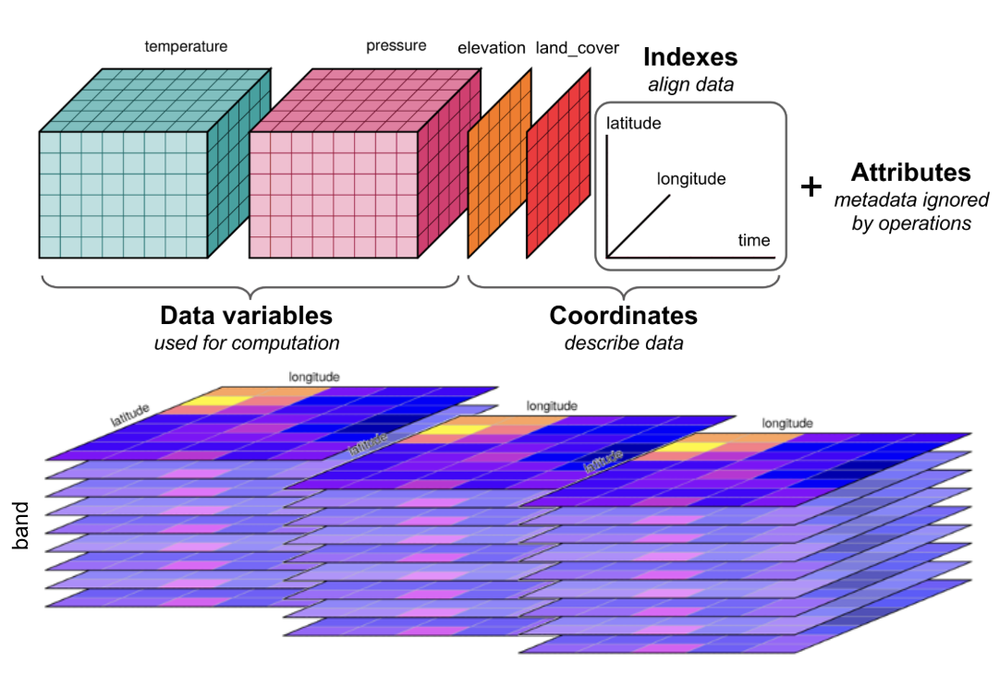
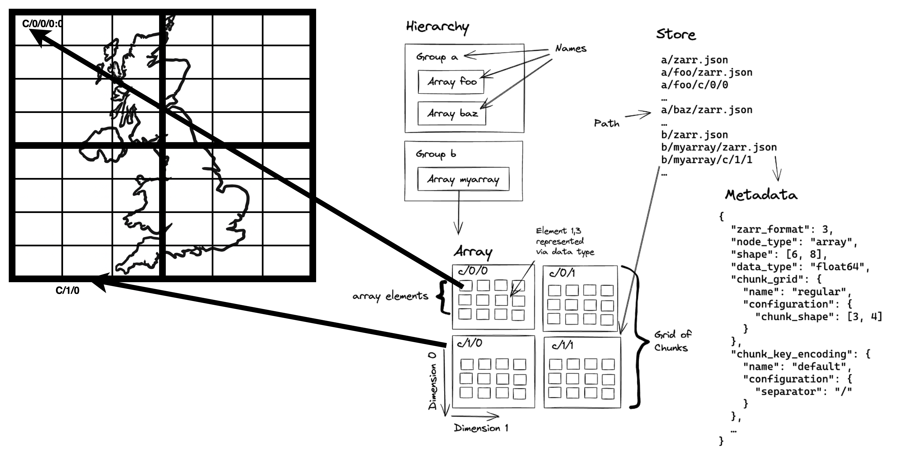

# Zarr

Zarr is an open-source format designed for storing large, N-dimensional data cubes in the cloud. It is ideal for datasets that are too large to be handled efficiently as single, monolithic files, such as time-series of satellite imagery or outputs from climate and weather models.

Instead of a single file, a Zarr store is a collection of many small files or objects. The large N-dimensional array is broken down into smaller, blocks called **chunks**, and each chunk is  stored as a separate, compressed object (or several [chunks combined and stored as "shards"](https://zarr.readthedocs.io/en/stable/user-guide/arrays.html#user-guide-sharding)). The entire structure of the dataset, including the dimensions, data types, and the location of every chunk, is described in small, JSON metadata files, and is typically consolidated into one metadata file (often named `.zmetadata`).



## What is a Data Cube

A data cube is a multi-dimensional array used to organize complex data. While a standard 2D image has dimensions like `latitude` and `longitude`, a data cube extends this by "stacking" data along additional dimensions. For example, a data series taken over a year can be organized into a cube with a `time` dimension.

This structure can be extended with even more dimensions, such as spectral bands, vertical levels - creating an N-dimensional array. Organizing data this way is powerful because it allows you to easily select subsets or slice the data, for instance, extracting a complete time series for a single geographic point with a single command.

To learn more about working with data cubes in a cloud environment, we recommend the [Cubes and Clouds MOOC](https://eo-college.org/courses/cubes-and-clouds/).

This design enables highly efficient data access. A client application first reads the single, lightweight metadata file to get a "map" of the entire dataset. It can then calculate which specific chunks are needed to satisfy a user's request (e.g., a spatial subset or a time slice) and fetch *only those chunks*, often in parallel. This approach reduces data transfer and I/O overhead, making it possible to perform scalable analysis on massive datasets with tools like Xarray.

To ensure interoperability for geospatial data, the **GeoZarr** specification provides conventions for storing coordinate reference systems and other critical metadata within a Zarr store.

## Best Practice GeoZarr

A plain Zarr file is just a container for data grids. To fix this, you must add location information by following the GeoZarr rules. EarthCODE requires  Zarr files to follow the GeoZarr standard.

* **1. Name Your Dimensions:** For each data variable (like `temperature`), you must add a tag called `_ARRAY_DIMENSIONS`. This tag should be a list of your dimension names in the correct order, like `["time", "y", "x"]`. This makes the structure of your data grid clear to any tool.

* **2. Provide Coordinate Values:** For each dimension you name (like `time`, `y`, `x`), you must also provide a list of its values. For example, the `time` dimension needs a list of all the timestamps. This tells software exactly where each row, column, and time slice is located.

* **3. Define the Map Projection (CRS):** You must include the map projection information (the Coordinate Reference System, or CRS). This tells mapping software how to place your data grid correctly on a world map.

* **4. Include Overviews (Highly Recommended):** If your data will be viewed on a map, it is strongly recommended that you save smaller, lower-resolution versions of your data inside the Zarr file. These "overviews" or "pyramids" are essential for fast zooming and panning in web viewers and GIS software.

Read the [Zarr User Guide](https://zarr.readthedocs.io/en/stable/user-guide/) for more information about the Zarr format.

## Organisation of a Zarr file




### Zarr Organisation

* **Hierarchy:** The folder-like structure of a Zarr store. It's a tree of "groups" (folders) and "arrays" (the actual data). A group can contain other groups or arrays, but an array is a final endpoint.

* **Group:** A container that acts like a folder within a Zarr store. It can hold multiple arrays and other groups, helping to organize a complex dataset.

* **Array:** The core data container. It's a multi-dimensional grid (e.g., a 2D image or 3D cube) where all data points have the same data type, like '32-bit integer'.

* **Dimension:** An axis of an array. A 2D image has two dimensions (height, width), while a data cube could have three or more (e.g., time, latitude, longitude).

* **Chunk:** To handle large datasets, the main array is broken into smaller, equally-sized blocks called chunks. These are the basic units of storage and are often compressed and stored as individual files.

* **Grid:** The regular, grid-like pattern formed by all the chunks that make up the complete array. All chunks in an array have the same shape and fit together perfectly.

* **Element:** A single data value within an array, like one pixel in an image or one temperature reading in a data cube. Each element is located by its coordinates along the dimensions.


## Describing Zarr with STAC For EarthCODE

For EarthCODE, a single logical Zarr dataset, should be described by a single STAC Collection. This provides a simple access point for users while ensuring the data is discoverable.

The following practices are expected:

1.  **One Collection per Zarr Store:** Each complete Zarr dataset should be represented by one STAC Collection. This collection should include a collection-level asset that links directly to the root of the Zarr store.

2.  **Use the Data Cube Extension:** To make the contents of your Zarr store searchable, you must use the **STAC Data Cube Extension**. This extension is used to list the scientific variables (e.g., `temperature`, `precipitation`) and dimensions contained within the Zarr store directly in the STAC Collection's metadata. This allows users to find your dataset by searching the EarthCODE catalog for the specific variables they need.

3.  **Consolidate Zarr Metadata:** For optimal performance in the cloud, the Zarr store itself **must** have consolidated metadata. This creates a single `.zmetadata` file, allowing client applications to understand the entire structure of the data cube with a single request, avoiding potentially thousands of individual reads.

See an example of the [STAC metadata for Zarr.](https://opensciencedata.esa.int/external/eoresults.esa.int/stac/collections/YIPEEO-CROPYIELDS)

This approach provides users have a simple access point to the entire data cube, while the key variables remain discoverable through the main EarthCODE catalog.

For a detailed, step-by-step guide on generating the required STAC metadata for a Zarr dataset, please follow the [EarthCODE Zarr Tutorial](https://esa-earthcode.github.io/tutorials/prr-zarr/).

## Using Zarr

To access a Zarr dataset, first search the EarthCODE STAC catalog to find the relevant **Collection** on the Open Science catalog and retrieve the Zarr store's URL from the asset link and open it directly with a library like **Xarray**. This creates a *lazily-loaded* data cube by reading only the consolidated metadata upfront. Actual data is only streamed from the cloud when you perform a computation.

From that point, STAC's role in discovery is complete. All analysis, including subsetting by time or space, filtering, and calculating, is done using Xarray's powerful functions directly on the data cube.

## When to Use Zarr in EarthCODE

You are encouraged to use Zarr when your dataset can be represented as a **well-aligned, multi-dimensional data cube**.

This approach is ideal for regularly gridded data where individual data granules share a common spatial grid, resolution, and can be easily stacked along dimensions like time. By consolidating these into a single Zarr store, you create an analysis-ready product.

Good candidates for Zarr include:
* Time series from climate models or reanalysis products.
* Gridded, composite satellite data that has been processed to a standard grid (e.g. Level 3 or Level 4 data).

Conversely, if your data consists of un-aligned, individual scenes with varying footprints or acquisition times (such as Level 1 or Level 2 satellite imagery), the recommended approach is to use Cloud-Optimized GeoTIFFs (COGs) cataloged with STAC.

## Zip+Zarr on the PRR

Currently, Zarr stores in the EarthCODE PRR are archived as single `.zip` files.

**Please note that this is an interim solution.**

The following Python example demonstrates how to use `fsspec` and `xarray` to read a `.zarr.zip` archive directly from an HTTP URL.

```python
import fsspec
from xarray import open_datatree
from zarr.storage import ZipStore
from fsspec.implementations.http import HTTPFileSystem

class HttpZipStore(ZipStore):
    def __init__(self, path) -> None:
        super().__init__(path='', mode="r")
        self.path = path

def _load_zip_zarr(url, **kwargs):
    fs = HTTPFileSystem(asynchronous=False, block_size=10000)
    zipfile = fs.open(url)
    store = HttpZipStore(zipfile)
    return open_datatree(store, engine="zarr", **kwargs)

url = 'https://eoresults.esa.int/d/YIPEEO-CROPYIELDS/2016/01/01/yipeeo-cropyields-sentinel2-features/features2.zarr.zip'
ds = _load_zip_zarr(url)
```


Writing Zipp+Zarr
```py
zip_path = "my_dataset.zarr.zip"

with zarr.ZipStore(zip_path, mode='w') as store:
    ds.to_zarr(store, consolidated=True)
```

## Converting to Zarr

You will typically encounter two main situations when converting existing data archives into a cloud-optimized Zarr store.

For detailed instructions, please refer to the data conversion tutorials on the EarthCODE tutorial pages.

### From a Collection of GeoTIFFs/COGs

When your goal is to stack a collection of 2D GeoTIFF files into a multi-dimensional data cube (e.g., adding a `time` dimension), the most flexible approach is to use Python libraries.

Using **Xarray** with the **rioxarray** engine allows you to open a series of individual GeoTIFFs and combine them into a single data cube, which can then be written to a Zarr store.

Alternatively, GDAL offers [gdal_translate](https://gdal.org/en/stable/drivers/raster/zarr.html) and a zarr engine for converting.

### From NetCDF

Converting from NetCDF to Zarr is easy using Python, specifically with the **Xarray** library. The workflow involves opening your NetCDF file(s) into an Xarray Dataset and then using the `.to_zarr()` method to write the output.

It is critical to define an appropriate chunking scheme for your data's dimensions and to create a consolidated metadata file for optimal cloud performance.

```python
import xarray as xr

# Open one or more NetCDF files into a single Dataset
ds = xr.open_mfdataset("path/to/source_files/*.nc")

# Write to a Zarr store with consolidated metadata and custom chunking
ds.to_zarr(
    "output.zarr",
    consolidated=True,
    mode="w",
    # Example encoding to specify chunks for a variable (time, y, x)
    encoding={"temperature": {"chunks": (10, 256, 256)}}
)
```

<!-- Data producers should carefully optimize their data products for partial data reads (via HTTP or direct S3 access) to make them as cloud friendly as possible. This requires organizing the data into appropriate producer-defined chunk sizes to facilitate access. The best guidance thus far is that S3 reads are optimized in the 8-16 megabyte (MB) range [57] presenting a reasonable range of chunk sizes. The Pangeo Project [58] reported chunk sizes ranging from 10-200 MB when reading Zarr data stored in the cloud using Dask [59] and the desired chunking often depends on the likely access pattern (e.g., chunking in small Regions of Interest (ROIs) for long time series data requests vs. chunking in larger ROI slices for large spatial requests over a smaller temporal range). However, on the other end of the spectrum, chunks that are too small, on the order of a few megabytes, typically impede read performance in the cloud. Data producers are advised to consult EarthCODE platform guidance and PRR guidelines regarding approaches to chunking and access.
 -->


## Best Practice: Chunking and Consolidation

Optimizing your Zarr store's internal layout is critical for performance in a cloud environment. Follow these three key practices when creating your data.

* **Choose the Right Chunk Size and Shape**
    The goal of chunking is to balance overhead and usability. Chunks that are too small lead to many slow network requests, while chunks that are too large are inefficient for partial access.
    * **Size:** Aim for a target chunk size between **50 MB and 200 MB** after compression. This is generally the sweet spot for cloud object storage.
    * **Shape:** Align the shape of your chunks with the most common analysis patterns. For time-series analysis (accessing one location over all time), make chunks large in the time dimension and small in the spatial dimensions. For creating maps (accessing a large area at one time), make chunks large in the spatial dimensions and small (size 1) in the time dimension.

* **Avoid Writing Empty Chunks**
    An "empty chunk" is a chunk that contains only the fill value (e.g., `NaN`). Writing these chunks to storage is wasteful, creating unnecessary files and metadata. Configure your Zarr writing library to detect and skip writing these empty chunks. A Zarr reader will see a `null` entry for that chunk in the metadata and will correctly fill the area with the appropriate fill value without needing to make a network request.

* **Consolidate Your Metadata**
By default, a Zarr store's metadata is scattered across many small JSON files. In a cloud environment, reading all of these files can require hundreds of slow network requests. You **must consolidate** your metadata into a single master index file (`.zmetadata`). This allows a client to understand the entire structure of your data cube, including the location of every single chunk, with just **one initial request**. When using Python's Xarray, this is as simple as setting `consolidated=True` in the `.to_zarr()` method.
