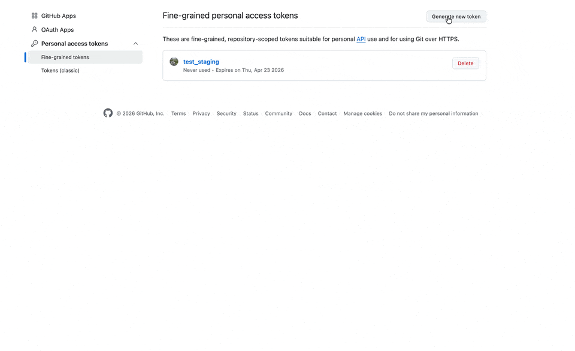
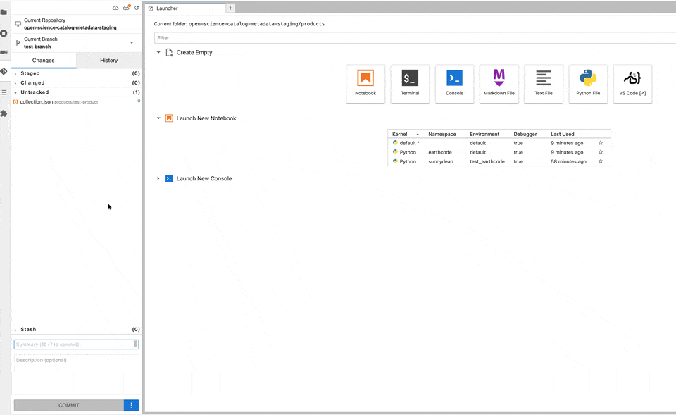

# Contributing Code During the Hackathon

Please add your hackathon work under `5_Hackathon_Code/`.

## Get the Repository

Use the hackathon repository:

https://github.com/ESA-EarthCODE/polar_hackathon

In the workspace, you can also open it with the git-puller link:

https://workspace.polar-hackathon.hub-otc-sc.eox.at/hub/user-redirect/git-pull?repo=https%3A%2F%2Fgithub.com%2FESA-EarthCODE%2Fpolar_hackathon&urlpath=lab%2Ftree%2Fpolar_hackathon%2F0_Introduction%2Fintro.ipynb&branch=main

If you already cloned the repository, pull the latest changes before you start.

## Commit Your Work

Run these commands in a terminal, not inside a notebook:

```bash
git switch -c <branch-name>
git status
git add 5_Hackathon_Code/
git commit -m "Add hackathon contribution"
git push origin <branch-name>
```

Choose a short branch name that describes your work, for example `add-sea-ice-notebook`.

If you do not have write access to the main repository, create the branch in your fork, push it there, and open a pull request from your fork's branch into the hackathon repository.

## Workspace Git GUI

If the workspace asks for GitHub authentication, create a fine-grained token at:

https://github.com/settings/personal-access-tokens

Limit the token to the hackathon repository and give it read/write `Contents` access.



You can create a branch and commit changes using the Polar TEP Workspaces Git GUI or the terminal commands above.



## Open a Pull Request

Open a pull request against:

https://github.com/ESA-EarthCODE/polar_hackathon/pulls

[GitHub Docs: Creating a pull request](https://docs.github.com/en/pull-requests/collaborating-with-pull-requests/proposing-changes-to-your-work-with-pull-requests/creating-a-pull-request)

After creating the pull request, check that it appears on the pull request list and follow up on any review comments.
